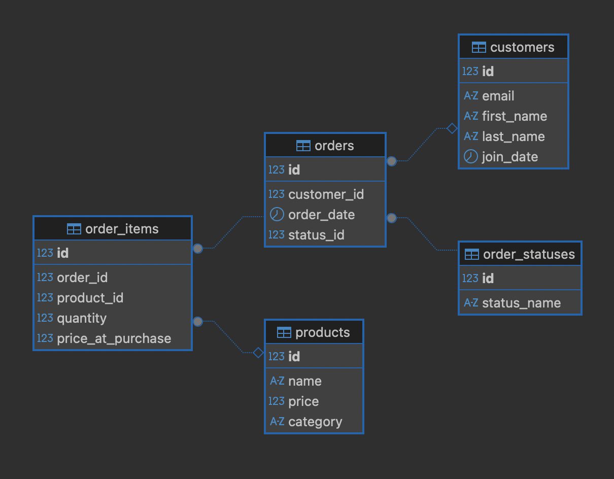

# E-commerce Analytics Service

[](https://www.oracle.com/java/)
[](https://spring.io/projects/spring-boot)
[](https://www.jooq.org/)
[](https://www.postgresql.org/)
[](https://projectlombok.org/)
[](https://www.docker.com/)
[]()

A Spring Boot REST API that provides analytics insights for an e-commerce platform. The service uses jOOQ for type-safe SQL queries, Lombok for reducing boilerplate code, and PostgreSQL for data persistence.

---

## Table of Contents

- [Features](#features)
- [Technology Stack](#technology-stack)
- [Prerequisites](#prerequisites)
- [Quick Start](#quick-start)
- [API Endpoints](#api-endpoints)
- [Database Schema](#database-schema)
- [Testing](#testing)
- [Development](#development)
- [Security](#security)
- [Troubleshooting](#troubleshooting)
- [Contributing](#contributing)

## Features

- **Sales Analytics by Category**: Get total sales grouped by product category
- **Top Selling Products**: Identify products with the highest quantity sold (customizable limit)
- **Top Spenders**: Find customers with the highest total spending (customizable limit)
- **Product Ranking by Category**: Get top-ranked products within each category using window functions
- **Order Status Summary**: View order counts grouped by status
- **Average Order Value**: Calculate the average value across all orders
- **Flexible Query Limits**: Client-controlled result limits with centralized validation (default: 10, max: 100)
- **API Versioning**: Clean API structure with `/v1/` prefix
- **RESTful Endpoints**: Kebab-case endpoint naming for consistency
- **API Key Authentication**: Secure endpoints with API key-based authentication
- **Automated Data Seeding**: Generate realistic test data using JavaFaker
- **Dockerized Deployment**: Run the entire stack with Docker Compose
- **Clean Code Architecture**: Constants management, validation utilities, and Lombok integration

## Technology Stack

- **Java 21**: Latest LTS version of Java
- **Spring Boot 3.5.7**: Modern Spring Boot framework
- **jOOQ 3.19.27**: Type-safe SQL query builder with window functions support
- **PostgreSQL 16**: Relational database
- **Lombok**: Reduces boilerplate code in DTOs and entities
- **Docker & Docker Compose**: Containerization
- **Maven**: Dependency management and build tool
- **Testcontainers**: Integration testing with real database
- **JUnit 5**: Testing framework
- **JavaFaker**: Test data generation

## Prerequisites

- Java 21 or higher
- Maven 3.9+
- Docker and Docker Compose
- Git (optional, for version control)

## Project Structure

```
analytics-service/
├── src/
│   ├── main/
│   │   ├── java/com/ecommerce/analytics/
│   │   │   ├── config/              # Security and API key configuration
│   │   │   ├── constants/           # Application constants
│   │   │   ├── controller/          # REST API controllers
│   │   │   ├── dto/                 # Data Transfer Objects (Lombok)
│   │   │   ├── jooq/                # Auto-generated jOOQ classes
│   │   │   ├── repository/          # jOOQ repositories
│   │   │   ├── service/             # Business logic services
│   │   │   ├── util/                # Validation utilities
│   │   │   ├── DataSeeder.java      # Test data generator
│   │   │   └── EcommerceAnalyticsServiceApplication.java
│   │   └── resources/
│   │       ├── application.properties   # Application configuration
│   │       └── init_scheme.sql          # Database schema
│   └── test/
│       ├── java/                    # Integration tests
│       └── resources/
│           └── init_scheme.sql      # Test database schema
├── docker-compose.yml               # Docker services configuration
├── Dockerfile                       # Application container definition
├── pom.xml                          # Maven dependencies
└── .env                             # Environment variables
```

## Quick Start

### 1️⃣ Clone the Repository

```bash
git clone <repository-url>
cd ecommerce_analytics_service_demo
```

### 2️⃣ Configure Environment Variables

Copy the example environment file and update with your values:

```bash
cp .env.example .env
```

Edit `.env`:
```env
POSTGRES_USER=your_username
POSTGRES_PASSWORD=your_secure_password
POSTGRES_DB=ecommerce_analytics_db
APP_API_KEY=your-api-key-here
```

> **⚠️ Important**: Use strong passwords and API keys in production!

### 3️⃣ Build and Run with Docker Compose

```bash
# Remove old volumes (first time or after schema changes)
docker-compose down -v

# Build and start services
docker-compose up --build
```

The application will be available at **http://localhost:8080**

### 4️⃣ Verify the Application

```bash
# Check container status
docker ps

# Test an endpoint
curl -H "X-API-Key: your-api-key-here" http://localhost:8080/v1/analytics/sales-by-category
```

You should see:
- ✅ `analytics-postgres` (PostgreSQL on port 5433)
- ✅ `analytics-service` (Spring Boot on port 8080)

## API Endpoints

> **🔐 Authentication**: All endpoints require the `X-API-Key` header

### Endpoints Overview

| Endpoint | Method | Description |
|----------|--------|-------------|
| `/v1/analytics/sales-by-category` | GET | Get total sales grouped by product category |
| `/v1/analytics/top-selling-products` | POST | Get products sorted by quantity sold (with customizable limit) |
| `/v1/analytics/top-spenders` | POST | Get customers with highest total spending (with customizable limit) |
| `/v1/analytics/status-summary` | GET | Get order counts grouped by status |
| `/v1/analytics/average-order-value` | GET | Calculate average value across all orders |

---

### Detailed Examples

<details>
<summary><b>1. Sales by Category</b></summary>

Get total sales grouped by product category.

```bash
curl -H "X-API-Key: the-most-secret-password" \
  http://localhost:8080/v1/analytics/sales-by-category
```

**Response:**
```json
[
  {
    "category": "Books, Clothing & Music",
    "totalSales": 47179.12
  },
  {
    "category": "Computers",
    "totalSales": 21361.41
  }
]
```

</details>

<details>
<summary><b>2. Top Selling Products</b></summary>

Get products sorted by total quantity sold with customizable limit.

**Request Body Parameters:**
- `limit` (optional): Number of top products to return (default: 10, max: 100)

```bash
curl -X POST \
  -H "X-API-Key: the-most-secret-password" \
  -H "Content-Type: application/json" \
  -d '{"limit": 10}' \
  http://localhost:8080/v1/analytics/top-selling-products
```

**Request Examples:**
```bash
# Get top 5 products
curl -X POST \
  -H "X-API-Key: the-most-secret-password" \
  -H "Content-Type: application/json" \
  -d '{"limit": 5}' \
  http://localhost:8080/v1/analytics/top-selling-products

# Get top 50 products
curl -X POST \
  -H "X-API-Key: the-most-secret-password" \
  -H "Content-Type: application/json" \
  -d '{"limit": 50}' \
  http://localhost:8080/v1/analytics/top-selling-products

# Use default (10) - empty body or limit: 10
curl -X POST \
  -H "X-API-Key: the-most-secret-password" \
  -H "Content-Type: application/json" \
  -d '{}' \
  http://localhost:8080/v1/analytics/top-selling-products
```

**Response:**
```json
[
  {
    "productId": 5,
    "productName": "Sleek Plastic Watch",
    "totalQuantitySold": 1124
  },
  {
    "productId": 3,
    "productName": "Fantastic Copper Hat",
    "totalQuantitySold": 827
  }
]
```

**Limit Validation:**
- Values ≤ 0 or null → defaults to 10
- Values > 100 → capped at 100

</details>

<details>
<summary><b>3. Top Spenders</b></summary>

Get customers with the highest total spending with customizable limit.

**Request Body Parameters:**
- `limit` (optional): Number of top spenders to return (default: 10, max: 100)

```bash
curl -X POST \
  -H "X-API-Key: the-most-secret-password" \
  -H "Content-Type: application/json" \
  -d '{"limit": 10}' \
  http://localhost:8080/v1/analytics/top-spenders
```

**Request Examples:**
```bash
# Get top 20 spenders
curl -X POST \
  -H "X-API-Key: the-most-secret-password" \
  -H "Content-Type: application/json" \
  -d '{"limit": 20}' \
  http://localhost:8080/v1/analytics/top-spenders

# Use default (10)
curl -X POST \
  -H "X-API-Key: the-most-secret-password" \
  -H "Content-Type: application/json" \
  -d '{}' \
  http://localhost:8080/v1/analytics/top-spenders
```

**Response:**
```json
[
  {
    "customerId": 12,
    "email": "john.doe@example.com",
    "fullName": "John Doe",
    "totalSpend": 15234.50
  }
]
```

**Limit Validation:**
- Values ≤ 0 or null → defaults to 10
- Values > 100 → capped at 100

</details>

<details>
<summary><b>4. Order Status Summary</b></summary>

Get order counts grouped by status.

```bash
curl -H "X-API-Key: the-most-secret-password" \
  http://localhost:8080/v1/analytics/status-summary
```

**Response:**
```json
[
  {
    "statusName": "Delivered",
    "orderCount": 450
  },
  {
    "statusName": "Processing",
    "orderCount": 123
  }
]
```

</details>

<details>
<summary><b>5. Average Order Value</b></summary>

Calculate the average value across all orders.

```bash
curl -H "X-API-Key: the-most-secret-password" \
  http://localhost:8080/v1/analytics/average-order-value
```

**Response:**
```json
{
  "averageOrderValue": 40180.67
}
```

</details>

---

## Database Schema

<p align="center">
  
</p>

The application uses the following database tables:

- **order_statuses**: Order status definitions (Processing, Shipped, Delivered, etc.)
- **customers**: Customer information (name, email, join date)
- **products**: Product catalog (name, price, category)
- **orders**: Order records with customer and status references
- **order_items**: Line items for each order with quantity and price at purchase

### Relationships

- `orders.customer_id` → `customers.id`
- `orders.status_id` → `order_statuses.id`
- `order_items.order_id` → `orders.id`
- `order_items.product_id` → `products.id`

The schema is automatically initialized when the PostgreSQL container starts using `/docker-entrypoint-initdb.d/init.sql`.

---

## Testing

### Run Integration Tests

Integration tests use Testcontainers to spin up a real PostgreSQL instance:

```bash
./mvnw test
```

Tests include:
- **AnalyticsControllerTest**: REST API endpoint tests with MockMvc
- **AnalyticsServiceTest**: Business logic tests
- **AnalyticsRepositoryTest**: jOOQ repository tests

### Test Configuration

Tests use a separate profile (`application-test.properties`) and initialize the database with test data before each test.

---

## Development

### Running Locally Without Docker

1. Start a local PostgreSQL instance:
```bash
docker run -d \
  --name postgres-dev \
  -p 5432:5432 \
  -e POSTGRES_USER=your_user \
  -e POSTGRES_PASSWORD=your_password \
  -e POSTGRES_DB=ecommerce_analytics_db \
  postgres:16
```

2. Initialize the database schema:
```bash
psql -h localhost -U your_user -d ecommerce_analytics_db -f src/main/java/init_scheme.sql
```

3. Run the application:
```bash
./mvnw spring-boot:run
```

### Regenerating jOOQ Code

When the database schema changes, regenerate jOOQ classes:

```bash
# Make sure PostgreSQL is running with the latest schema
./mvnw clean compile -Pjooq-codegen
```

This runs the `jooq-codegen` Maven profile which:
1. Connects to your database
2. Introspects the schema
3. Generates type-safe Java classes in `src/main/java/com/ecommerce/analytics/jooq/`

**Generated Files Location:**
```
src/main/java/com/ecommerce/analytics/jooq/
├── DefaultCatalog.java
├── Keys.java
├── Public.java
├── Tables.java                    # Main entry point
└── tables/
    ├── Customers.java
    ├── OrderItems.java
    ├── OrderStatuses.java
    ├── Orders.java
    ├── Products.java
    └── records/
        └── ... (Record classes)
```

### Build Commands

```bash
# Generate JOOQ tables
./mvnw clean compile -Pjooq-codegen

# Run the application
./mvnw spring-boot:run

# Build JAR package
./mvnw clean package -DskipTests

# Run the JAR
java -jar target/analytics-service-0.0.1-SNAPSHOT.jar

# Run tests
./mvnw test
```

### Viewing Logs

```bash
# Follow application logs
docker logs -f analytics-service

# Follow PostgreSQL logs
docker logs -f analytics-postgres

# View all logs
docker-compose logs -f
```

---

## Security

The application uses API key-based authentication:

- All endpoints require the `X-API-Key` header
- The API key is configured via the `APP_API_KEY` environment variable
- Spring Security validates the API key before allowing access

**Production Recommendations:**
- Use strong, randomly generated API keys
- Store API keys in a secrets management system (e.g., AWS Secrets Manager, HashiCorp Vault)
- Consider implementing rate limiting
- Use HTTPS for all communications
- Implement request logging and monitoring

## Stopping the Application

```bash
# Stop and remove containers (keeps volumes)
docker-compose down

# Stop and remove containers and volumes (fresh start)
docker-compose down -v
```

---

## Troubleshooting

### Database Schema Not Initialized

If you see errors about missing tables, ensure you've removed old volumes:
```bash
docker-compose down -v
docker-compose up --build
```

### Port Conflicts

If port 8080 or 5433 is already in use, modify `docker-compose.yml`:
```yaml
services:
  postgres-db:
    ports:
      - "5434:5432"  # Change external port
  analytics-service:
    ports:
      - "8081:8080"  # Change external port
```

### Connection Refused

Ensure both containers are running and healthy:
```bash
docker ps
docker logs analytics-service
docker logs analytics-postgres
```

### Docker Build Issues

If the Docker build fails with JAR file not found:
```bash
# Clean build
./mvnw clean package -DskipTests

# Rebuild Docker image
docker-compose build --no-cache

# Start services
docker-compose up
```

## Recent Updates

### Version 2.0 - Code Restructuring
- **Package Restructure**: Migrated from `com.github.*` to `com.ecommerce.analytics`
- **Lombok Integration**: Added Lombok to reduce boilerplate in DTOs
- **API Versioning**: All endpoints now use `/v1/analytics/` prefix
- **Kebab-case Endpoints**: Consistent RESTful naming (e.g., `/top-selling-products`)
- **Constants Management**: Centralized constants in `AnalyticsConstants` class
- **Validation Utilities**: Extracted validation logic to `ValidationUtils`
- **Code Quality**: Replaced magic values and improved semantic naming
- **Window Functions**: Added advanced SQL queries with window functions
- **Artifact Rename**: Changed artifact ID to `analytics-service`

## License

This project is provided as-is for educational and demonstration purposes.

## Contributing

Contributions are welcome! Please feel free to submit a Pull Request.

## Contact

For questions or support, please open an issue in the repository.
